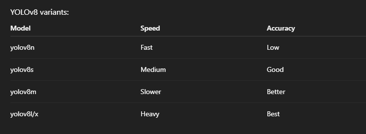
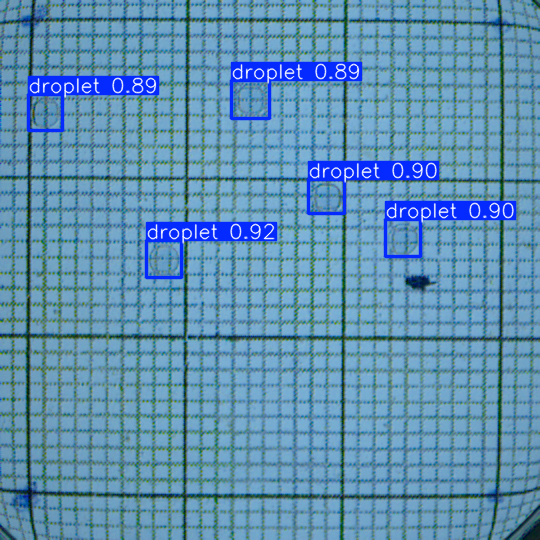

# Project Title

**Author:** Pranav Shinde
**Date:** 29 March 2026
**Version:** v0.1  

---

# Chapter 1 — Overview

## Goal
	
- To analyze Images with YOLO Object detection 

## Problem Statement

-

## Motivation

- 

## Expected Outcome

-

---

# Chapter 2 — Background / Theory

## Key Concepts

-

## Mathematical / Technical Details

$$
 \sin^2(\theta)
% Use LaTeX math here
$$

## References

1. Paper / Article  
2. Book  
3. Documentation  

---

# Chapter 3 — Resources

## Papers

-

## Tutorials

-

## Useful Links

- [Link name](https://example.com)

---

# Chapter 4 — Plan / Approach

## Strategy
we will train a model on labelled images 	 
###   Training Yolo Model 
1.  Labelling Images
    * You install cvat locally with docker image [you can check their website](https://docs.cvat.ai/docs/administration/community/basics/installation/)
	*  we will use cvat to label images for training the YOLO
		  -  labelled around 465 images 
		  - for training -  369 images
		  - for testing - 96 images
    * you can download the labelled training data [here](https://drive.google.com/file/d/1YWVnfMuNJO_Di130NsePJgGqrJToUVVq/view?usp=sharing)  
	*  folder structure for training yolo 8 model
	```text
	dataset/
	├── images/
	│   ├── train/
	│   └── val/
	└── labels/
	    ├── train/
	    └── val/
	```
 
	*  Create a `data.yaml` file
	  ```
	path: dataset
	train: images/train
	val: images/val
	
	names:
	  0: droplet
	  ```

		- path: dataset
			This is the root directory of your dataset.
		- train: images/train
			This tells YOLO,“Training images are inside dataset/images/train”
		- val: images/val
			This tells YOLO,“Validation images are inside dataset/images/val”
		-names: (class mapping)
			names:
			  0: droplet
			  1: bubble
			This defines:
			class_id → class_name
	* Train YOLO model
	```python
	from ultralytics import YOLO
	model = YOLO("yolov8m.pt")
	model.train(
	    data="data.yaml",
	    epochs=50,
	    imgsz=640)
	```
	* Some models other yolo8 models
	  
	* we will use `yolov8m.pt` with 93 layers, 25,840,339 parameters 
	* the corresponding log file has all the data regarding  model
	  - [log file](./logs.txt)
	* Training will  produce Pytorch Tensors `last.pt` and `best.pt`  ,so  we will chose
	  `best.pt` for inference from `runs/detect/train/weights` folder

### Inference 
*  we will load our model with weigths `best.pt` 
  ```python
	model = YOLO('./runs/detect/train/weights/best.pt')
	pred = model.predict('./0005890.png')
	for i in pred:
    i.show()
```
*  we will take a image `0005890.png` from `5gm_NaBrO3_0.5MH2SO4\2ul` folder to test our model
* image after inferenece
  
	- It is successfully able to detect all droplets
	  


	  
## Steps

- [ ] Step 1  
- [ ] Step 2  
- [ ] Step 3  

---

# Chapter 5 — Implementation

## Setup

- Language:
  * python
- Tools:
- Libraries:
  * ultralytics
  * numpy
  * Matplotlib
- Hardware:
  * GPU - RTX 3060ti

---

## Folder Structure

```text
project/
│── src/
│── data/
│── results/
│── notebooks/
│── images/
